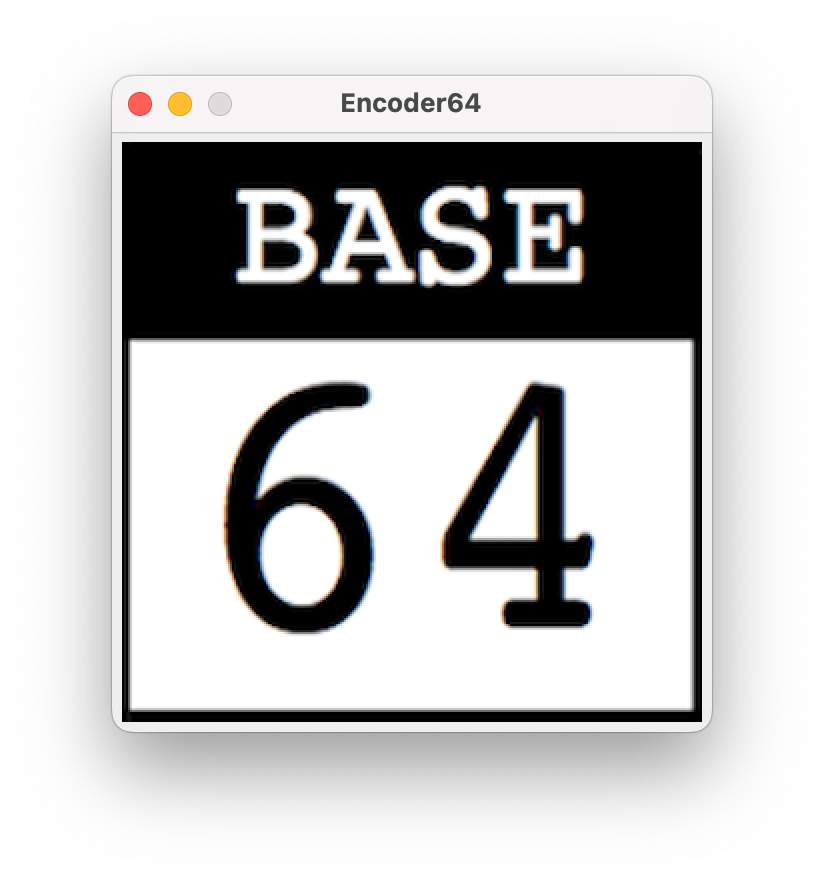

# Encoder64
A simple Java application that:

1. Opens an "always-on-top" window in the top right corner of the desktop
2. Responds to a single file being "dropped" (as in drag-and-drop) into the window pane by performing a [Base64](https://en.wikipedia.org/wiki/Base64) encoding
3. The result of the encoding is then placed into the system clipboard, so that it can be immediately pasted into a separate application

